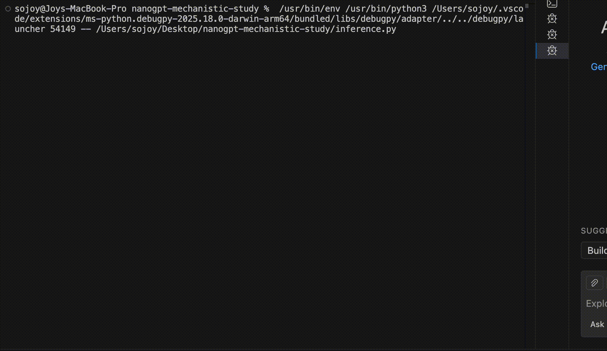

# Nanogpt-mechanistic-study

# Regency-Era Language Modeling 

## Project Overview
This is a custom implementation of a causal, decoder-only Transformer (GPT-2 style) built from scratch. This project demonstrates the feasibility of training high-parameter models on consumer-grade Apple Silicon, transitioning from simple character-level statistics to capturing the complex, ironic prose of **Jane Austen**.

## Live Demo


The model was developed to study **Mechanistic Interpretability** and hardware acceleration using the **Metal Performance Shaders (MPS)** backend.

## Why Jane Austen?
I chose the works of Jane Austen (*Pride & Prejudice*, *Emma*, etc.) for their unique technical challenges:
* **Syntactic Complexity:** Regency-era English features long, nested clauses that test the model's *Long-Range Dependencies*.
* **Subtle Sémantics:** Capturing Austen's famous irony requires fine-tuned Attention Heads.
* **Vocabulary:** The model must master a specific 19th-century lexicon to remain coherent.

## Technical Specifications & Scaling
I conducted a scaling study to observe the jump in "intelligence" when moving from a CPU-bound toy model to a GPU-accelerated prototype.

| Feature | Baseline | **AustenGPT (This Repo)** |
| :--- | :--- | :--- |
| **Parameters** | 0.21 Million | **10.81 Million** |
| **Context Window** | 32 tokens | **256 tokens** |
| **Backend** | CPU | **MPS (Apple M4 Pro GPU)** |
| **Final Val Loss** | ~2.50 | **1.1474** |


## Training Dynamics (M4 Pro Optimization)
By leveraging the **MPS backend**, the model complexity was scaled **50x** without increasing training time (~15 minutes). 

* **Optimization:** AdamW with a learning rate of 3e-4.
* **Convergence:** The loss dropped from 4.73 (random) to **1.14**, indicating strong structural learning of the Austenian style.

## Project Structure
```text
.
├── model.py           # Core Transformer architecture (Multi-Head Attention, Blocks)
├── train_main.py      # Main training pipeline with MPS acceleration
├── inference.py       # Generation script for pre-trained weights
├── model_final.pt     # Final trained weights (1.14 loss)
├── austen.txt         # Dataset (Jane Austen's complete works)
├── requirements.txt   # Dependencies (torch, numpy)
└── .gitignore         # Optimized to exclude heavy binaries from Git